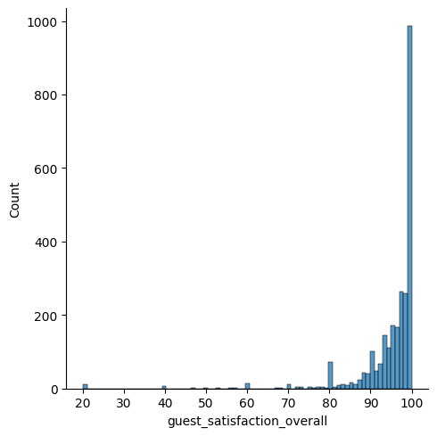
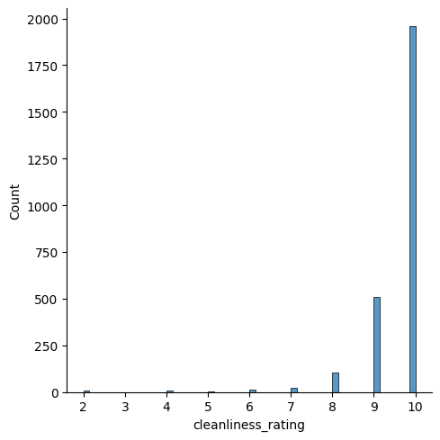
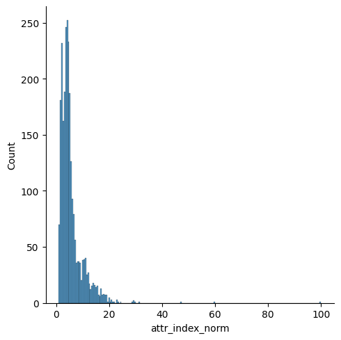
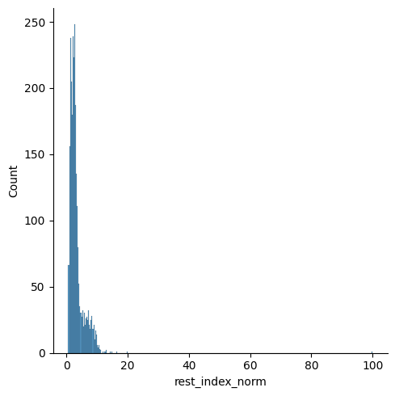
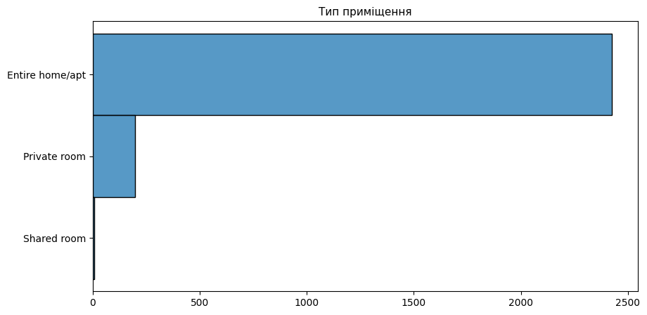

Цей проект присвячений аналізу даних про ціни на оренду житла та інші показники на сайті Airbnb у Афінах. Для аналізу впливу різних показників на ціну оренди була застосована модель лінійної регресії. Також будуть надані рекомендації для реальних та потенційних орендодавців.

Датасет був взятий з цього сайту:\
https://zenodo.org/records/4446043#.Y9Y9ENJBwUE\
Він містить дані про столицю Греції - Афіни за вихідні дні.

Цей набір даних містить інформацію щодо оренди помешкань на сайті Airbnb в Афінах, включаючи ціну, тип кімнати, статус господаря, зручності та інформацію про місцезнаходження:  

- realSum - повна вартість проживання двох осіб протягом двох ночей в євро.  
- room_type тип орендованого приміщення.  
- room_shared  - чи ділите кімнату з іншими (господар або гості).  
- room_private - чи є кімната повністю у вашому розпорядженні на час оренди.  
- person_capacity - максимальна кількість людей, яку можна розмістити.  
- host_is_superhost - чи визначено орендодавця як супергосподаря на Airbnb.  
- multi - чи пропонує господар кілька кімнат для оренди в одному приміщенні.  
- biz - чи може бути орендовано приміщення для бізнес-зустрічей.  
- cleanliness_rating  - загальна оцінка чистоти приміщення при поселенні.  
- guest_satisfaction_overall - наскільки гості задоволені своїм перебуванням в помешканні.  
- bedrooms -  Загальна кількість спалень, що пропонується для оренди господарем (0 для квартири-студії).  
- dist  - відстань від центру міста.  
- metro_dist - відстань до найближчої станції метро.  
- attr_index_norm -  нормалізований індекс привабливості (0-100) місця розташування помешкання.  
- attr_index_norm - нормалізований індекс привабливості (0-100) закладів харчування (кафе, ресторани і т.д.).  
- lng, lat - географічні координати приміщення, що пропонується для оренди.  


```python
#імпортуємо усі потрібні бібліотеки
import numpy as np
import pandas as pd
import matplotlib.pyplot as plt
import seaborn as sns
#зчитуємо датасет із файлу csv у датефрейм
data = pd.read_csv('athens_weekends.csv') 
```

На початку аналізу хочу відмітити, що, судячи з постановки завдання, найкращим та єдиним методом для вирішення поставленої проблеми є, очевидно, лінійна регресія, адже вихідний показник - це число, ціна оренди квартири.

Але перед будь-яким аналізом, потрібно привести усі дані до такого стану, щоб вони для цього аналізу підходили.

## 1. Перевірка датасету та виправлення/видалення пропусків/аномальних показників та загальна підготовка даних.


```python
data
```


<div>
<table border="1" class="dataframe">
  <thead>
    <tr style="text-align: right;">
      <th></th>
      <th>Unnamed: 0</th>
      <th>realSum</th>
      <th>room_type</th>
      <th>room_shared</th>
      <th>room_private</th>
      <th>person_capacity</th>
      <th>host_is_superhost</th>
      <th>multi</th>
      <th>biz</th>
      <th>cleanliness_rating</th>
      <th>guest_satisfaction_overall</th>
      <th>bedrooms</th>
      <th>dist</th>
      <th>metro_dist</th>
      <th>attr_index</th>
      <th>attr_index_norm</th>
      <th>rest_index</th>
      <th>rest_index_norm</th>
      <th>lng</th>
      <th>lat</th>
    </tr>
  </thead>
  <tbody>
    <tr>
      <th>0</th>
      <td>0</td>
      <td>138.963748</td>
      <td>Entire home/apt</td>
      <td>False</td>
      <td>False</td>
      <td>4.0</td>
      <td>True</td>
      <td>1</td>
      <td>0</td>
      <td>10.0</td>
      <td>96.0</td>
      <td>1</td>
      <td>0.407278</td>
      <td>0.304570</td>
      <td>240.306496</td>
      <td>9.054205</td>
      <td>407.167958</td>
      <td>6.080622</td>
      <td>23.73168</td>
      <td>37.97776</td>
    </tr>
    <tr>
      <th>1</th>
      <td>1</td>
      <td>91.627024</td>
      <td>Entire home/apt</td>
      <td>False</td>
      <td>False</td>
      <td>4.0</td>
      <td>True</td>
      <td>1</td>
      <td>0</td>
      <td>10.0</td>
      <td>99.0</td>
      <td>1</td>
      <td>4.367463</td>
      <td>0.297474</td>
      <td>39.802996</td>
      <td>1.499687</td>
      <td>58.706522</td>
      <td>0.876720</td>
      <td>23.72712</td>
      <td>38.01435</td>
    </tr>
    <tr>
      <th>2</th>
      <td>2</td>
      <td>76.629250</td>
      <td>Private room</td>
      <td>False</td>
      <td>True</td>
      <td>2.0</td>
      <td>False</td>
      <td>0</td>
      <td>0</td>
      <td>10.0</td>
      <td>100.0</td>
      <td>1</td>
      <td>2.194174</td>
      <td>0.385247</td>
      <td>78.734001</td>
      <td>2.966519</td>
      <td>113.326684</td>
      <td>1.692414</td>
      <td>23.73391</td>
      <td>37.99529</td>
    </tr>
    <tr>
      <th>3</th>
      <td>3</td>
      <td>151.852459</td>
      <td>Entire home/apt</td>
      <td>False</td>
      <td>False</td>
      <td>4.0</td>
      <td>True</td>
      <td>0</td>
      <td>1</td>
      <td>10.0</td>
      <td>100.0</td>
      <td>2</td>
      <td>2.508982</td>
      <td>0.563473</td>
      <td>68.774881</td>
      <td>2.591282</td>
      <td>101.162069</td>
      <td>1.510748</td>
      <td>23.73200</td>
      <td>37.99800</td>
    </tr>
    <tr>
      <th>4</th>
      <td>4</td>
      <td>98.657231</td>
      <td>Entire home/apt</td>
      <td>False</td>
      <td>False</td>
      <td>2.0</td>
      <td>True</td>
      <td>1</td>
      <td>0</td>
      <td>10.0</td>
      <td>95.0</td>
      <td>1</td>
      <td>2.740581</td>
      <td>0.725045</td>
      <td>62.902859</td>
      <td>2.370037</td>
      <td>92.611125</td>
      <td>1.383049</td>
      <td>23.73100</td>
      <td>38.00000</td>
    </tr>
    <tr>
      <th>...</th>
      <td>...</td>
      <td>...</td>
      <td>...</td>
      <td>...</td>
      <td>...</td>
      <td>...</td>
      <td>...</td>
      <td>...</td>
      <td>...</td>
      <td>...</td>
      <td>...</td>
      <td>...</td>
      <td>...</td>
      <td>...</td>
      <td>...</td>
      <td>...</td>
      <td>...</td>
      <td>...</td>
      <td>...</td>
      <td>...</td>
    </tr>
    <tr>
      <th>2622</th>
      <td>2622</td>
      <td>74.051508</td>
      <td>Entire home/apt</td>
      <td>False</td>
      <td>False</td>
      <td>3.0</td>
      <td>True</td>
      <td>0</td>
      <td>0</td>
      <td>10.0</td>
      <td>98.0</td>
      <td>1</td>
      <td>3.311976</td>
      <td>1.856865</td>
      <td>49.097725</td>
      <td>1.849891</td>
      <td>71.119758</td>
      <td>1.062098</td>
      <td>23.75000</td>
      <td>38.00306</td>
    </tr>
    <tr>
      <th>2623</th>
      <td>2623</td>
      <td>295.737351</td>
      <td>Entire home/apt</td>
      <td>False</td>
      <td>False</td>
      <td>4.0</td>
      <td>True</td>
      <td>0</td>
      <td>1</td>
      <td>10.0</td>
      <td>100.0</td>
      <td>1</td>
      <td>1.800556</td>
      <td>0.571033</td>
      <td>146.240703</td>
      <td>5.510019</td>
      <td>203.884287</td>
      <td>3.044796</td>
      <td>23.71500</td>
      <td>37.97400</td>
    </tr>
    <tr>
      <th>2624</th>
      <td>2624</td>
      <td>169.193635</td>
      <td>Entire home/apt</td>
      <td>False</td>
      <td>False</td>
      <td>4.0</td>
      <td>True</td>
      <td>0</td>
      <td>1</td>
      <td>10.0</td>
      <td>99.0</td>
      <td>2</td>
      <td>3.845100</td>
      <td>0.786416</td>
      <td>42.260382</td>
      <td>1.592276</td>
      <td>60.948754</td>
      <td>0.910205</td>
      <td>23.76657</td>
      <td>37.99986</td>
    </tr>
    <tr>
      <th>2625</th>
      <td>2625</td>
      <td>160.991728</td>
      <td>Entire home/apt</td>
      <td>False</td>
      <td>False</td>
      <td>4.0</td>
      <td>True</td>
      <td>1</td>
      <td>0</td>
      <td>10.0</td>
      <td>100.0</td>
      <td>1</td>
      <td>4.827460</td>
      <td>0.141952</td>
      <td>35.700540</td>
      <td>1.345116</td>
      <td>52.659912</td>
      <td>0.786420</td>
      <td>23.73300</td>
      <td>38.01900</td>
    </tr>
    <tr>
      <th>2626</th>
      <td>2626</td>
      <td>192.393317</td>
      <td>Entire home/apt</td>
      <td>False</td>
      <td>False</td>
      <td>4.0</td>
      <td>False</td>
      <td>0</td>
      <td>1</td>
      <td>10.0</td>
      <td>99.0</td>
      <td>1</td>
      <td>1.776319</td>
      <td>0.317120</td>
      <td>107.126909</td>
      <td>4.036300</td>
      <td>149.191222</td>
      <td>2.228013</td>
      <td>23.72863</td>
      <td>37.99064</td>
    </tr>
  </tbody>
</table>
<p>2627 rows × 20 columns</p>
</div>


```python
#виводимо інформацію про стовпчики датафрейму
data.info()
```

    <class 'pandas.core.frame.DataFrame'>
    RangeIndex: 2627 entries, 0 to 2626
    Data columns (total 20 columns):
     #   Column                      Non-Null Count  Dtype  
    ---  ------                      --------------  -----  
     0   Unnamed: 0                  2627 non-null   int64  
     1   realSum                     2627 non-null   float64
     2   room_type                   2627 non-null   object 
     3   room_shared                 2627 non-null   bool   
     4   room_private                2627 non-null   bool   
     5   person_capacity             2627 non-null   float64
     6   host_is_superhost           2627 non-null   bool   
     7   multi                       2627 non-null   int64  
     8   biz                         2627 non-null   int64  
     9   cleanliness_rating          2627 non-null   float64
     10  guest_satisfaction_overall  2627 non-null   float64
     11  bedrooms                    2627 non-null   int64  
     12  dist                        2627 non-null   float64
     13  metro_dist                  2627 non-null   float64
     14  attr_index                  2627 non-null   float64
     15  attr_index_norm             2627 non-null   float64
     16  rest_index                  2627 non-null   float64
     17  rest_index_norm             2627 non-null   float64
     18  lng                         2627 non-null   float64
     19  lat                         2627 non-null   float64
    dtypes: bool(3), float64(12), int64(4), object(1)
    memory usage: 356.7+ KB
    

Пропущені дані відсутні та усі стовпчики відповідають своєму типу даних.

Для початку видалимо стовпчик "Unnamed: 0", адже ми зможемо скористатись автоматичною індексацією даних.


```python
#видалення стовпчику з оригінального датасету(за допомогою inplace = True) за його назвою 
data.drop(["Unnamed: 0"], axis=1, inplace = True)
```

Також, для зручності, перекодуємо значення у стовпчику host_is_superhost у 0 та 1. Стовпчики room_shared та room_private видалимо, адже ці стовпчики дублюють значення зі стопчика під назвою room_type та будуть створені саме із цього стовпчика у процесі його перекодування.
Також можна видалити стовпчики attr_index та rest_index, бо в датасеті вже присутні нормалізовані значення цих даних.


```python
data.drop(["room_shared"], axis=1, inplace = True)
data.drop(["room_private"], axis=1, inplace = True)
data.drop(["attr_index"], axis=1, inplace = True)
data.drop(["rest_index"], axis=1, inplace = True)
#за допомогою методу .astype змінюємо тип стовпчика на int, що нам і потрібно
data["host_is_superhost"] = data["host_is_superhost"].astype(int)
data
```


<div>

<table border="1" class="dataframe">
  <thead>
    <tr style="text-align: right;">
      <th></th>
      <th>realSum</th>
      <th>room_type</th>
      <th>person_capacity</th>
      <th>host_is_superhost</th>
      <th>multi</th>
      <th>biz</th>
      <th>cleanliness_rating</th>
      <th>guest_satisfaction_overall</th>
      <th>bedrooms</th>
      <th>dist</th>
      <th>metro_dist</th>
      <th>attr_index_norm</th>
      <th>rest_index_norm</th>
      <th>lng</th>
      <th>lat</th>
    </tr>
  </thead>
  <tbody>
    <tr>
      <th>0</th>
      <td>138.963748</td>
      <td>Entire home/apt</td>
      <td>4.0</td>
      <td>1</td>
      <td>1</td>
      <td>0</td>
      <td>10.0</td>
      <td>96.0</td>
      <td>1</td>
      <td>0.407278</td>
      <td>0.304570</td>
      <td>9.054205</td>
      <td>6.080622</td>
      <td>23.73168</td>
      <td>37.97776</td>
    </tr>
    <tr>
      <th>1</th>
      <td>91.627024</td>
      <td>Entire home/apt</td>
      <td>4.0</td>
      <td>1</td>
      <td>1</td>
      <td>0</td>
      <td>10.0</td>
      <td>99.0</td>
      <td>1</td>
      <td>4.367463</td>
      <td>0.297474</td>
      <td>1.499687</td>
      <td>0.876720</td>
      <td>23.72712</td>
      <td>38.01435</td>
    </tr>
    <tr>
      <th>2</th>
      <td>76.629250</td>
      <td>Private room</td>
      <td>2.0</td>
      <td>0</td>
      <td>0</td>
      <td>0</td>
      <td>10.0</td>
      <td>100.0</td>
      <td>1</td>
      <td>2.194174</td>
      <td>0.385247</td>
      <td>2.966519</td>
      <td>1.692414</td>
      <td>23.73391</td>
      <td>37.99529</td>
    </tr>
    <tr>
      <th>3</th>
      <td>151.852459</td>
      <td>Entire home/apt</td>
      <td>4.0</td>
      <td>1</td>
      <td>0</td>
      <td>1</td>
      <td>10.0</td>
      <td>100.0</td>
      <td>2</td>
      <td>2.508982</td>
      <td>0.563473</td>
      <td>2.591282</td>
      <td>1.510748</td>
      <td>23.73200</td>
      <td>37.99800</td>
    </tr>
    <tr>
      <th>4</th>
      <td>98.657231</td>
      <td>Entire home/apt</td>
      <td>2.0</td>
      <td>1</td>
      <td>1</td>
      <td>0</td>
      <td>10.0</td>
      <td>95.0</td>
      <td>1</td>
      <td>2.740581</td>
      <td>0.725045</td>
      <td>2.370037</td>
      <td>1.383049</td>
      <td>23.73100</td>
      <td>38.00000</td>
    </tr>
    <tr>
      <th>...</th>
      <td>...</td>
      <td>...</td>
      <td>...</td>
      <td>...</td>
      <td>...</td>
      <td>...</td>
      <td>...</td>
      <td>...</td>
      <td>...</td>
      <td>...</td>
      <td>...</td>
      <td>...</td>
      <td>...</td>
      <td>...</td>
      <td>...</td>
    </tr>
    <tr>
      <th>2622</th>
      <td>74.051508</td>
      <td>Entire home/apt</td>
      <td>3.0</td>
      <td>1</td>
      <td>0</td>
      <td>0</td>
      <td>10.0</td>
      <td>98.0</td>
      <td>1</td>
      <td>3.311976</td>
      <td>1.856865</td>
      <td>1.849891</td>
      <td>1.062098</td>
      <td>23.75000</td>
      <td>38.00306</td>
    </tr>
    <tr>
      <th>2623</th>
      <td>295.737351</td>
      <td>Entire home/apt</td>
      <td>4.0</td>
      <td>1</td>
      <td>0</td>
      <td>1</td>
      <td>10.0</td>
      <td>100.0</td>
      <td>1</td>
      <td>1.800556</td>
      <td>0.571033</td>
      <td>5.510019</td>
      <td>3.044796</td>
      <td>23.71500</td>
      <td>37.97400</td>
    </tr>
    <tr>
      <th>2624</th>
      <td>169.193635</td>
      <td>Entire home/apt</td>
      <td>4.0</td>
      <td>1</td>
      <td>0</td>
      <td>1</td>
      <td>10.0</td>
      <td>99.0</td>
      <td>2</td>
      <td>3.845100</td>
      <td>0.786416</td>
      <td>1.592276</td>
      <td>0.910205</td>
      <td>23.76657</td>
      <td>37.99986</td>
    </tr>
    <tr>
      <th>2625</th>
      <td>160.991728</td>
      <td>Entire home/apt</td>
      <td>4.0</td>
      <td>1</td>
      <td>1</td>
      <td>0</td>
      <td>10.0</td>
      <td>100.0</td>
      <td>1</td>
      <td>4.827460</td>
      <td>0.141952</td>
      <td>1.345116</td>
      <td>0.786420</td>
      <td>23.73300</td>
      <td>38.01900</td>
    </tr>
    <tr>
      <th>2626</th>
      <td>192.393317</td>
      <td>Entire home/apt</td>
      <td>4.0</td>
      <td>0</td>
      <td>0</td>
      <td>1</td>
      <td>10.0</td>
      <td>99.0</td>
      <td>1</td>
      <td>1.776319</td>
      <td>0.317120</td>
      <td>4.036300</td>
      <td>2.228013</td>
      <td>23.72863</td>
      <td>37.99064</td>
    </tr>
  </tbody>
</table>
<p>2627 rows × 15 columns</p>
</div>


Тепер перевіримо датафрейм на аномалії та викиди:


```python
#виведення описової статистики по датафрейму
data.describe()
```


<div>

<table border="1" class="dataframe">
  <thead>
    <tr style="text-align: right;">
      <th></th>
      <th>realSum</th>
      <th>person_capacity</th>
      <th>host_is_superhost</th>
      <th>multi</th>
      <th>biz</th>
      <th>cleanliness_rating</th>
      <th>guest_satisfaction_overall</th>
      <th>bedrooms</th>
      <th>dist</th>
      <th>metro_dist</th>
      <th>attr_index_norm</th>
      <th>rest_index_norm</th>
      <th>lng</th>
      <th>lat</th>
    </tr>
  </thead>
  <tbody>
    <tr>
      <th>count</th>
      <td>2627.000000</td>
      <td>2627.000000</td>
      <td>2627.000000</td>
      <td>2627.000000</td>
      <td>2627.000000</td>
      <td>2627.00000</td>
      <td>2627.000000</td>
      <td>2627.000000</td>
      <td>2627.000000</td>
      <td>2627.000000</td>
      <td>2627.000000</td>
      <td>2627.000000</td>
      <td>2627.000000</td>
      <td>2627.000000</td>
    </tr>
    <tr>
      <th>mean</th>
      <td>147.580456</td>
      <td>3.690141</td>
      <td>0.426342</td>
      <td>0.261134</td>
      <td>0.381804</td>
      <td>9.63190</td>
      <td>94.905976</td>
      <td>1.264180</td>
      <td>1.821674</td>
      <td>0.480538</td>
      <td>5.626333</td>
      <td>3.231077</td>
      <td>23.731827</td>
      <td>37.981153</td>
    </tr>
    <tr>
      <th>std</th>
      <td>79.814934</td>
      <td>1.283763</td>
      <td>0.494639</td>
      <td>0.439337</td>
      <td>0.485921</td>
      <td>0.84905</td>
      <td>8.426506</td>
      <td>0.646232</td>
      <td>0.956845</td>
      <td>0.286426</td>
      <td>4.515683</td>
      <td>2.908393</td>
      <td>0.013461</td>
      <td>0.013813</td>
    </tr>
    <tr>
      <th>min</th>
      <td>42.884259</td>
      <td>2.000000</td>
      <td>0.000000</td>
      <td>0.000000</td>
      <td>0.000000</td>
      <td>2.00000</td>
      <td>20.000000</td>
      <td>0.000000</td>
      <td>0.113560</td>
      <td>0.020224</td>
      <td>1.040228</td>
      <td>0.592757</td>
      <td>23.702710</td>
      <td>37.953000</td>
    </tr>
    <tr>
      <th>25%</th>
      <td>98.657231</td>
      <td>3.000000</td>
      <td>0.000000</td>
      <td>0.000000</td>
      <td>0.000000</td>
      <td>9.00000</td>
      <td>93.000000</td>
      <td>1.000000</td>
      <td>1.136893</td>
      <td>0.286208</td>
      <td>3.040342</td>
      <td>1.716206</td>
      <td>23.723135</td>
      <td>37.969420</td>
    </tr>
    <tr>
      <th>50%</th>
      <td>127.715417</td>
      <td>4.000000</td>
      <td>0.000000</td>
      <td>0.000000</td>
      <td>0.000000</td>
      <td>10.00000</td>
      <td>97.000000</td>
      <td>1.000000</td>
      <td>1.668721</td>
      <td>0.419438</td>
      <td>4.449542</td>
      <td>2.577194</td>
      <td>23.729800</td>
      <td>37.979480</td>
    </tr>
    <tr>
      <th>75%</th>
      <td>171.537037</td>
      <td>4.000000</td>
      <td>1.000000</td>
      <td>1.000000</td>
      <td>1.000000</td>
      <td>10.00000</td>
      <td>100.000000</td>
      <td>2.000000</td>
      <td>2.314173</td>
      <td>0.599855</td>
      <td>6.449582</td>
      <td>3.669073</td>
      <td>23.739510</td>
      <td>37.989960</td>
    </tr>
    <tr>
      <th>max</th>
      <td>1043.282638</td>
      <td>6.000000</td>
      <td>1.000000</td>
      <td>1.000000</td>
      <td>1.000000</td>
      <td>10.00000</td>
      <td>100.000000</td>
      <td>4.000000</td>
      <td>6.222396</td>
      <td>1.959657</td>
      <td>100.000000</td>
      <td>100.000000</td>
      <td>23.786020</td>
      <td>38.031140</td>
    </tr>
  </tbody>
</table>
</div>


Жодних аномальних даних, що б виходили завстановлені для кожного стовпчика межі, немає

## 2.Розвідковий та візуальний аналіз даних


```python
data.describe()
```


<div>

<table border="1" class="dataframe">
  <thead>
    <tr style="text-align: right;">
      <th></th>
      <th>realSum</th>
      <th>person_capacity</th>
      <th>host_is_superhost</th>
      <th>multi</th>
      <th>biz</th>
      <th>cleanliness_rating</th>
      <th>guest_satisfaction_overall</th>
      <th>bedrooms</th>
      <th>dist</th>
      <th>metro_dist</th>
      <th>attr_index_norm</th>
      <th>rest_index_norm</th>
      <th>lng</th>
      <th>lat</th>
    </tr>
  </thead>
  <tbody>
    <tr>
      <th>count</th>
      <td>2627.000000</td>
      <td>2627.000000</td>
      <td>2627.000000</td>
      <td>2627.000000</td>
      <td>2627.000000</td>
      <td>2627.00000</td>
      <td>2627.000000</td>
      <td>2627.000000</td>
      <td>2627.000000</td>
      <td>2627.000000</td>
      <td>2627.000000</td>
      <td>2627.000000</td>
      <td>2627.000000</td>
      <td>2627.000000</td>
    </tr>
    <tr>
      <th>mean</th>
      <td>147.580456</td>
      <td>3.690141</td>
      <td>0.426342</td>
      <td>0.261134</td>
      <td>0.381804</td>
      <td>9.63190</td>
      <td>94.905976</td>
      <td>1.264180</td>
      <td>1.821674</td>
      <td>0.480538</td>
      <td>5.626333</td>
      <td>3.231077</td>
      <td>23.731827</td>
      <td>37.981153</td>
    </tr>
    <tr>
      <th>std</th>
      <td>79.814934</td>
      <td>1.283763</td>
      <td>0.494639</td>
      <td>0.439337</td>
      <td>0.485921</td>
      <td>0.84905</td>
      <td>8.426506</td>
      <td>0.646232</td>
      <td>0.956845</td>
      <td>0.286426</td>
      <td>4.515683</td>
      <td>2.908393</td>
      <td>0.013461</td>
      <td>0.013813</td>
    </tr>
    <tr>
      <th>min</th>
      <td>42.884259</td>
      <td>2.000000</td>
      <td>0.000000</td>
      <td>0.000000</td>
      <td>0.000000</td>
      <td>2.00000</td>
      <td>20.000000</td>
      <td>0.000000</td>
      <td>0.113560</td>
      <td>0.020224</td>
      <td>1.040228</td>
      <td>0.592757</td>
      <td>23.702710</td>
      <td>37.953000</td>
    </tr>
    <tr>
      <th>25%</th>
      <td>98.657231</td>
      <td>3.000000</td>
      <td>0.000000</td>
      <td>0.000000</td>
      <td>0.000000</td>
      <td>9.00000</td>
      <td>93.000000</td>
      <td>1.000000</td>
      <td>1.136893</td>
      <td>0.286208</td>
      <td>3.040342</td>
      <td>1.716206</td>
      <td>23.723135</td>
      <td>37.969420</td>
    </tr>
    <tr>
      <th>50%</th>
      <td>127.715417</td>
      <td>4.000000</td>
      <td>0.000000</td>
      <td>0.000000</td>
      <td>0.000000</td>
      <td>10.00000</td>
      <td>97.000000</td>
      <td>1.000000</td>
      <td>1.668721</td>
      <td>0.419438</td>
      <td>4.449542</td>
      <td>2.577194</td>
      <td>23.729800</td>
      <td>37.979480</td>
    </tr>
    <tr>
      <th>75%</th>
      <td>171.537037</td>
      <td>4.000000</td>
      <td>1.000000</td>
      <td>1.000000</td>
      <td>1.000000</td>
      <td>10.00000</td>
      <td>100.000000</td>
      <td>2.000000</td>
      <td>2.314173</td>
      <td>0.599855</td>
      <td>6.449582</td>
      <td>3.669073</td>
      <td>23.739510</td>
      <td>37.989960</td>
    </tr>
    <tr>
      <th>max</th>
      <td>1043.282638</td>
      <td>6.000000</td>
      <td>1.000000</td>
      <td>1.000000</td>
      <td>1.000000</td>
      <td>10.00000</td>
      <td>100.000000</td>
      <td>4.000000</td>
      <td>6.222396</td>
      <td>1.959657</td>
      <td>100.000000</td>
      <td>100.000000</td>
      <td>23.786020</td>
      <td>38.031140</td>
    </tr>
  </tbody>
</table>
</div>


Проведемо аналіз середнього та медіани, для оцінки розподілу деяких показників:

**Повна вартість житла:**

Середнє значення становить 147.58  
Медіана(50 процентиль) - 127.7. 
Можна зробити висновок про правосторонню асиметрію у розподілі значень. Це може свідчити про те, що у виборці присутні більш крупні значення, які "тягнуть" середнє значення в правий бік. Це досить очікуваний ефект у випадку з ціанми на житло, бо декілька елітних приміщень з цінами близько 1000$

**Максимальна кількість людей:**

Середнє - 3.69  
Медіана - 4.00  Невеликий зсув середнього до меншого значення, у порівнянні з медіаною, каже про те, що помешкання частіше знімаються для кількості людей, меншої за 4, ніж більшої. 4 є найпопулярнішим варіантом

**Висновки щодо бінарних даних:**

Близько 42% власників житла цієї вибірки є супергосподарями 
Близько 26% власників житла цієї вибірки пропонують кілька кімнат 
Близько 38% приміщень мають можливість проведення бізнес-зустрічей  

**Кількість окремих спалень:**  

Середнє - 1.26  
Медіана - 2.00  
Середнє значення є істотно меншим за медіанне, можна зробити висновок, що найпопулярнішими варіантами є 2 та 1 спальні кімнати, 3-х та 4-х кімнатні помешкання цікаві меншій кількості людей.

**Нормалізоване значення привабливості місця помешкання:**  

Середнє - 5.62  
Медіана - 4.44  
З абсолютних значень видно, що більшість помешкань мають оцінку, мешну за 10% від максимальної (шкала від 0 до 100). Але середнє та медіана досить близькі, що свідчить про всього кілька аномально великих значень та як мінімум одне, що дорівнює 100.

**Нормалізоване значення привабливості закладів харчування:**  

Середнє - 3.23  
Медіана - 2.57  
Ситуація аналогічна до індексу привабливості місцевості - кілька аномально великих значень зсувають середнє до більших значень, але абсолютна більшість навіть не перетинає бар'єр у 10% від всієї шкали.

**Довгота:**  

Середнє - 23.731827  

**Широта:**  

Середнє - 37.981153    

Якщо взяти середні значення координат із описової статистики, то отримана точка знаходиться приблизно у 800 метрах на північний захід від Акрополю, у 500 м від комерційного центру міста, площі Омонія. І хоча цей метод є досить грубим, цю інформацію можна інтерпретувати як те, що місця для проживання туристів(адже Афіни - це, здебільшого, туристичне місто і приміщення здаються в оренду саме для туристів) знаходяться у історичному та комерційному центрі міста.

Погляньмо на форми розподілу деяких показників:


```python
#з використанням бібліотеки seaborn візуалізуємо графік розподілу у вигляді гістограми
sns.displot(data["guest_satisfaction_overall"], kind="hist");
```


    

    


```python
sns.displot(data["cleanliness_rating"], kind='hist');
```


    

    


У випадку показників guest_satisfaction_overall та cleanliness_rating абсолютна більшість значень знаходяять у діапазоні 90-100 та 9-10 відповідно. Це не обов'язково свідчить про повальну високу якість помешкань, скоріше про специфіку таких оцінок від пересічних користувачів. 


```python
sns.displot(data["attr_index_norm"], kind="hist");
```


    

    


```python
sns.displot(data["rest_index_norm"], kind="hist");
```


    

    


Загалом, висновки для показників attr_index_norm та rest_index_norm, що були зроблені на основі описової статистики, підтвердились

Також подивимось на категоріальні змінні(точніше, одну - room type):


```python
#задаємо розмір діаграми
plt.figure(figsize=(10,5))
#будуємо горизонтальну гістограму за стовпчиком room_type
sns.histplot(data=data, y = "room_type");

#задаємо назву діаграми
plt.title("Тип приміщення", fontsize=11);
#"обнулюємо" підписи на діаграмі
plt.ylabel("");
plt.xlabel("");
```


    

    


Видно, що абсолютна більшість господарів здають в оренду цілі квартири або будинки, покімнатно не здає майже ніхто. Біля 7.6% здають приватні кімнати, спільні ж кімнати здає менше 1% господарів.

## 3. Перекодування категоріальних ознак у числові


```python
#застосовуємо метод get_dummies із параметром drop_first= False, щоб перекодувати стовпчик room_type у числовий вигляд
#drop_first= False потрібний, щоб оригінальний стовпчик не видалявся і щоб ми не втратили ніяких даних
data = pd.get_dummies(data, columns=["room_type"], drop_first= False)
data = data.rename(columns={"room_type_Entire home/apt": "is_entire_home/apt"})
data = data.rename(columns={"room_type_Private room": "is_private_room"})
data = data.rename(columns={"room_type_Shared room": "is_shared_room"})
data
```


<div>

<table border="1" class="dataframe">
  <thead>
    <tr style="text-align: right;">
      <th></th>
      <th>realSum</th>
      <th>person_capacity</th>
      <th>host_is_superhost</th>
      <th>multi</th>
      <th>biz</th>
      <th>cleanliness_rating</th>
      <th>guest_satisfaction_overall</th>
      <th>bedrooms</th>
      <th>dist</th>
      <th>metro_dist</th>
      <th>attr_index_norm</th>
      <th>rest_index_norm</th>
      <th>lng</th>
      <th>lat</th>
      <th>is_entire_home/apt</th>
      <th>is_private_room</th>
      <th>is_shared_room</th>
    </tr>
  </thead>
  <tbody>
    <tr>
      <th>0</th>
      <td>138.963748</td>
      <td>4.0</td>
      <td>1</td>
      <td>1</td>
      <td>0</td>
      <td>10.0</td>
      <td>96.0</td>
      <td>1</td>
      <td>0.407278</td>
      <td>0.304570</td>
      <td>9.054205</td>
      <td>6.080622</td>
      <td>23.73168</td>
      <td>37.97776</td>
      <td>True</td>
      <td>False</td>
      <td>False</td>
    </tr>
    <tr>
      <th>1</th>
      <td>91.627024</td>
      <td>4.0</td>
      <td>1</td>
      <td>1</td>
      <td>0</td>
      <td>10.0</td>
      <td>99.0</td>
      <td>1</td>
      <td>4.367463</td>
      <td>0.297474</td>
      <td>1.499687</td>
      <td>0.876720</td>
      <td>23.72712</td>
      <td>38.01435</td>
      <td>True</td>
      <td>False</td>
      <td>False</td>
    </tr>
    <tr>
      <th>2</th>
      <td>76.629250</td>
      <td>2.0</td>
      <td>0</td>
      <td>0</td>
      <td>0</td>
      <td>10.0</td>
      <td>100.0</td>
      <td>1</td>
      <td>2.194174</td>
      <td>0.385247</td>
      <td>2.966519</td>
      <td>1.692414</td>
      <td>23.73391</td>
      <td>37.99529</td>
      <td>False</td>
      <td>True</td>
      <td>False</td>
    </tr>
    <tr>
      <th>3</th>
      <td>151.852459</td>
      <td>4.0</td>
      <td>1</td>
      <td>0</td>
      <td>1</td>
      <td>10.0</td>
      <td>100.0</td>
      <td>2</td>
      <td>2.508982</td>
      <td>0.563473</td>
      <td>2.591282</td>
      <td>1.510748</td>
      <td>23.73200</td>
      <td>37.99800</td>
      <td>True</td>
      <td>False</td>
      <td>False</td>
    </tr>
    <tr>
      <th>4</th>
      <td>98.657231</td>
      <td>2.0</td>
      <td>1</td>
      <td>1</td>
      <td>0</td>
      <td>10.0</td>
      <td>95.0</td>
      <td>1</td>
      <td>2.740581</td>
      <td>0.725045</td>
      <td>2.370037</td>
      <td>1.383049</td>
      <td>23.73100</td>
      <td>38.00000</td>
      <td>True</td>
      <td>False</td>
      <td>False</td>
    </tr>
    <tr>
      <th>...</th>
      <td>...</td>
      <td>...</td>
      <td>...</td>
      <td>...</td>
      <td>...</td>
      <td>...</td>
      <td>...</td>
      <td>...</td>
      <td>...</td>
      <td>...</td>
      <td>...</td>
      <td>...</td>
      <td>...</td>
      <td>...</td>
      <td>...</td>
      <td>...</td>
      <td>...</td>
    </tr>
    <tr>
      <th>2622</th>
      <td>74.051508</td>
      <td>3.0</td>
      <td>1</td>
      <td>0</td>
      <td>0</td>
      <td>10.0</td>
      <td>98.0</td>
      <td>1</td>
      <td>3.311976</td>
      <td>1.856865</td>
      <td>1.849891</td>
      <td>1.062098</td>
      <td>23.75000</td>
      <td>38.00306</td>
      <td>True</td>
      <td>False</td>
      <td>False</td>
    </tr>
    <tr>
      <th>2623</th>
      <td>295.737351</td>
      <td>4.0</td>
      <td>1</td>
      <td>0</td>
      <td>1</td>
      <td>10.0</td>
      <td>100.0</td>
      <td>1</td>
      <td>1.800556</td>
      <td>0.571033</td>
      <td>5.510019</td>
      <td>3.044796</td>
      <td>23.71500</td>
      <td>37.97400</td>
      <td>True</td>
      <td>False</td>
      <td>False</td>
    </tr>
    <tr>
      <th>2624</th>
      <td>169.193635</td>
      <td>4.0</td>
      <td>1</td>
      <td>0</td>
      <td>1</td>
      <td>10.0</td>
      <td>99.0</td>
      <td>2</td>
      <td>3.845100</td>
      <td>0.786416</td>
      <td>1.592276</td>
      <td>0.910205</td>
      <td>23.76657</td>
      <td>37.99986</td>
      <td>True</td>
      <td>False</td>
      <td>False</td>
    </tr>
    <tr>
      <th>2625</th>
      <td>160.991728</td>
      <td>4.0</td>
      <td>1</td>
      <td>1</td>
      <td>0</td>
      <td>10.0</td>
      <td>100.0</td>
      <td>1</td>
      <td>4.827460</td>
      <td>0.141952</td>
      <td>1.345116</td>
      <td>0.786420</td>
      <td>23.73300</td>
      <td>38.01900</td>
      <td>True</td>
      <td>False</td>
      <td>False</td>
    </tr>
    <tr>
      <th>2626</th>
      <td>192.393317</td>
      <td>4.0</td>
      <td>0</td>
      <td>0</td>
      <td>1</td>
      <td>10.0</td>
      <td>99.0</td>
      <td>1</td>
      <td>1.776319</td>
      <td>0.317120</td>
      <td>4.036300</td>
      <td>2.228013</td>
      <td>23.72863</td>
      <td>37.99064</td>
      <td>True</td>
      <td>False</td>
      <td>False</td>
    </tr>
  </tbody>
</table>
<p>2627 rows × 17 columns</p>
</div>


## 4. Створення матриці незалежних змінних і вектору цільово змінної та розподіл датафрейму на тренувальну та тестову вибірки


```python
#розділяємо датафрейм на два. в одному - тільки стовпчик realSum у ролі цільової змінної, у другому - решта стовпчиків у ролі незалежних змінних
X = data.drop("realSum", axis = 1)

Y = data.realSum
```


```python
#перетворюємо ці два датафрейми у numpy масиви
X_np = np.array(X)
print(X_np.shape)

#масив Y трансофруємо за допомогою методу .reshape, щоб він був двовимірним
Y_np = np.array(Y).reshape(-1,1)
print(Y_np.shape)
```

    (2627, 16)
    (2627, 1)
    

Розподіл вибірки на тренувальну та тестову з часткою тестової 0.25 та random_state=51763:


```python
#розподіл відбувається за дпомогою функції train_test_split, до якої ми передаємо numpy-масиви, які хочемо розділити, співвідношення трнувальної та тестової вибірок та сід для генератора псевдовипадкових чисел
from sklearn.model_selection import train_test_split
X_train, X_test, Y_train, Y_test = train_test_split(X_np, Y_np, test_size = 0.25, random_state=51763)
```

## 5. Побудова моделі лінійної регресії


```python
#імпортуємо клас лінійної регресії та інінціалізуємо об'єкт, що буде відповідати за нашу модель
from sklearn.linear_model import LinearRegression
linear_reg = LinearRegression()

#тренуємо на тренувальній вибірці за допомогою методу .fit
linear_reg.fit(X_train, Y_train);
```

Можна приступати до оцінки отриманої моделі:


```python
#імпотруємо тести MSE та R^2
from sklearn.metrics import mean_squared_error as MSE
from sklearn.metrics import r2_score

#записуємо результати прогнозів для тренувальної та тестової вибірок
Y_pred_train = linear_reg.predict(X_train)
Y_pred = linear_reg.predict(X_test)

#виводимо тести R^2 для двох вибірок (за допомогою методу .format)
print('R^2 train: {:.3f}'.format(r2_score(Y_train, Y_pred_train)))
print('R^2 test: {:.3f}'.format(r2_score(Y_test, Y_pred)))

#записуємо результати тестів MSE до змінних
rmse_train = MSE(Y_train,Y_pred_train, squared=False)
rmse_test = MSE(Y_test,Y_pred, squared=False)

#та виводимо ці змінні
print('Root Mean Squared Error train: {:.3f}'.format(rmse_train))
print('Root Mean Squared Error test: {:.3f}'.format(rmse_test))
```

    R^2 train: 0.348
    R^2 test: 0.428
    Root Mean Squared Error train: 64.260
    Root Mean Squared Error test: 60.778
    

Коефіцієнти детермінації є досить низькими, до того ж R^2 тестової вибірки є істотно (на 0.08) більшим за R^2 тренувлаьної вибірки, що свідчить про погану навченість моделі.

Що ж на рахунок RMSE, то вона також є нижчою для тестової вибірки, ніж для тренувальної.

## 6. Підбір найкращих параметрів регуляризації та пошук найкращої моделі за допомогою GridSearch


```python
#імпортуємо модуль ElasticNet, що відповідає за лінійну регресію з можливістю використання методів регуляризації
from sklearn.linear_model import ElasticNet
#та GridSearchCV що відповідає за мережевий пошук та крос-валідацію
from sklearn.model_selection import GridSearchCV

#інінціалізуємо об'єкт класу ElasticNet, що буде відповідати за нашу модель
el_net = ElasticNet()

#задаємо параметри alpha та l1_ratio, у яких вказуємо кількість кроків для кожного параметра та розмір цих кроків
en_grid = {'alpha': np.linspace(0,1,101),
          'l1_ratio': np.linspace(0,1,101)}

#інінціалізуємо об'єкт класу GridSearchCV, у конструктор якого передаємо потрібні параметри:
#модель(у нашому випадку el_net), сітку для alpha та l1_ratio, 
#спосіб, за яким оцінюємо якість моделі - у нашому випадку середньоквадратична похибка зі знаком мінус(через специфіку роботи оцінювача, який налаштований на "більше - краще"),
#кількість крос-валідацій(3 у нашому випадку)
#та кількість задіяних ядер(потоків) процесора(у нашому випадку - всі, щоб виконання коду не займало вічність)
grid = GridSearchCV(estimator=el_net,
                      param_grid=en_grid,
                      scoring='neg_mean_squared_error',
                       cv=3,
                       n_jobs=-1) 
```


```python
#запускаємо навчання моделі GridSearch
grid_result = grid.fit(X_train, Y_train)

#записуємо у змінну та виводимо найкращі параметри регуляризації
model_best = grid_result.best_estimator_
print(model_best)

#та здійснюємо оцінку моделі, що вже була описана вище
Y_pred_best_train = model_best.predict(X_train)
Y_pred_best = model_best.predict(X_test)


print('R^2 train: {:.3f}'.format(r2_score(Y_train, Y_pred_best_train)))
print('R^2 test: {:.3f}'.format(r2_score(Y_test, Y_pred_best)))

rmse_train = MSE(Y_train,Y_pred_best_train, squared=False)
rmse_test = MSE(Y_test,Y_pred_best, squared=False)

print('Root Mean Squared Error train: {:.3f}'.format(rmse_train))
print('Root Mean Squared Error test: {:.3f}'.format(rmse_test))
```

    ElasticNet(alpha=np.float64(1.0), l1_ratio=np.float64(0.0))
    R^2 train: 0.304
    R^2 test: 0.369
    Root Mean Squared Error train: 66.402
    Root Mean Squared Error test: 63.846
    

Результати, отримані за **звичайною лінійною регресією** без тюнінгу гіперпараметрів та крос-валідацій:  

ElasticNet(alpha= 1.0, l1_ratio= 0.0)\
R^2 train: 0.348\
R^2 test: 0.428\
Root Mean Squared Error train: 64.260\
Root Mean Squared Error test: 60.778 

Результати, отримані зі **101 кроком для alpha та l1, та з 10-ма крос-валідаціями**:

ElasticNet(alpha= 1.0, l1_ratio= 0.0)\
R^2 train: 0.304\
R^2 test: 0.369\
Root Mean Squared Error train: 66.402\
Root Mean Squared Error test: 63.846

Результати, отримані зі **201 кроком для alpha та l1, та з 10-ма крос-валідаціями**:

ElasticNet(alpha= 1.0, l1_ratio= 0.0)\
R^2 train: 0.304\
R^2 test: 0.369\
Root Mean Squared Error train: 66.402\
Root Mean Squared Error test: 63.846\

Результати, отримані зі **401 кроком для alpha та l1, та з 20-ма крос-валідаціями**:  

ElasticNet(alpha= 1.0, l1_ratio= 0.0)\
R^2 train: 0.304\
R^2 test: 0.369\
Root Mean Squared Error train: 66.402\
Root Mean Squared Error test: 63.846\

По-перше, очевидно, що жоден з варіантів гіперпараметрів, що був підібраний за допомогою GridSearch, не зміг перевершити модель, що була навчена без використання мережевого пошуку. Застосування мережевого пошуку не дало модель, що за якістю була б краща моделі, що була отримана за допомогою методу .fit(), застосованої до звичайного об'єкту моделі лінійної регресії.


```python
#виводимо вільний член нашої моделі(хоч він нам і не знадобиться)
print('intercept (b0):', '\n', linear_reg.intercept_)

#записуємо у новостворену змінну coefs коефіцієнти нашої моделі та індексуємо стовпчиками з того датафрейму, що вийшов після розділення основного датафрейму
coefs = pd.Series(data=linear_reg.coef_[0], index=X.columns)
coefs
```

    intercept (b0): 
     [-7243.38397988]
    
    person_capacity                12.510910
    host_is_superhost               1.870377
    multi                           6.962202
    biz                            29.548023
    cleanliness_rating              5.196343
    guest_satisfaction_overall      0.439372
    bedrooms                       20.795182
    dist                          -10.299316
    metro_dist                    -18.506508
    attr_index_norm                 3.872924
    rest_index_norm                 2.946745
    lng                           138.333718
    lat                           102.782858
    is_entire_home/apt             22.835199
    is_private_room                12.395432
    is_shared_room                -35.230631
    dtype: float64


Хоч якість моделі і бажає кращого, проаналізуємо всі коефіцієнти нижче:

Нагадаємо, що медіанна вартість оренди = 127.7 євро

**Типи приміщення:**  
Якщо господар здає в оренду цілу кімнату або будинок, то ціна оренди збільшується на 22.83 євро\
Якщо ж кімната спільна, то ціна зменшується на 35.23 євро\
За окрему приватну кімнату доплата складе 12.39 євро

**Кількість людей:**  
На диво, максимальна кількість людей несильно впливає на ціну - приміщення, що може вмістити на одну людину більше, буде на 12.5 євро дорожче. Хоча медіанний показник за вибіркою - 4 людини, чого може бути цілком достатньо для більшості орендарів. До того ж, цим показником досить просто маніпулювати та завищувати за допомогою тимчасових місць для сну.

**Супервласник:**  
За оренду приміщення у супервласника орендарі доплачують небагато - 1.87 євро  
*Супергосподарі Airbnb - це найрейтинговіші та найдосвідченіші господарі на Airbnb, які прагнуть надати вам неперевершену гостинність. Кожні 3 місяці кожен господар оцінюється на предмет гостинності. Супергосподарі відповідають усім критеріям - вони мають високий рейтинг, досвідчені, надійні та чуйні.* - цитата з сайту Airbnb. На мій розсуд, такий статус господіря має коштувати більше, хоча ми досліджуємо стан ринку, а він диктує свої правила.

Якщо **у власника кілька пропозицій на Airbnb**(тобто, це вже бізнес для власника), то кожна окрема пропозиція піднімається в ціні на 6.96 євро.

За **можливість проведення бізнес зустрічей** у своєму приміщенні, господар може просити на 29.54 євро більше за інших. Досить вигідно.

**Чистота:**  
Враховуючи те, що розподіл є надто нерівномірним(на оцінки 9 та 10 приходиться близько 90% відгуків), досить важко інтерпретувати цей показник.

**Загальне задоволення клієнтів:**
Розподіл цього параметра також дуже сильно зсунутий до максимальних значень, але хоча б більшої точності шкали можна зробити висновок, про те, що різниця у 1 балл важить приблизно 0.44 євро

**Спальні:**
Кожна додаткова спальна кімната с середньому здорожчує помешкання на 20.8 євро

**Відстань до центру міста:**
Кожен додатковий кілометр в середньому зменшує вартість помешкання на 10.3 євро

**Відстань до найближчої станції метро:**
Така ж ситуація простежується і з відстанню до метро - приміщення, що розташоване за 1 км, буде дешевше того, що розташоване прямо біля метро на 18.50 євро.

**Індекс привабливості місцевості:**
додаткові 3.87 євро за кожен бал

**Привабливість закладів харчування:**
додаткові 2.94 євро за кожен бал

**Координати:**
Присутня тенденція до збільшення ціни при збільшенні широти та довготи(при русі на північ та схід відповідно)

Щодо рекомендацій, що можна дати власникам цих приміщень:

З найголовнішого - дуже уважно слідкувати за відгуками орендарів, виправляти прорахунки, люди цінять оголошення з хорошими відгуками. Це ще й може допомогти отримати статус супергосподаря, що також дасть можливість трохи підняти ціну(хоч і незначно). Непогано було б облаштувати приміщення для бізнес-зустрічей - це відкриє ту частину ринку, що була до цього недоступна, а ті, хто огранізовують такі зустрічі, вочевидь, матимуть можливість заплатити більше. І, звичайно, зберігати приміщення у чистоті, це відвідувачі також сильно цінують.

З того, що треба враховувати(особливо для тих, хто купляє приміщення саме для здачі) - краще орієнтуватись на приміщення, що розташоване на сході або на півночі міста, здавати приміщення покімнатно, не заселяти кілька людей у одну кімнату. Також, вочевидь, треба підбирати локації у більш престижних районах, відстані до центра та метро є важливими факторами для збільшення ціни помешкання. Наявність дуже привабливих закладів харчування сильно не вплине на популярність оголошення, цим фактором можна нехтувати на користь більш вигідного розташування. Щодо максимальної кількості людей - також не треба сильно цим перейматись, чотири людини та дві кімнати відповідно буде достатньо.
